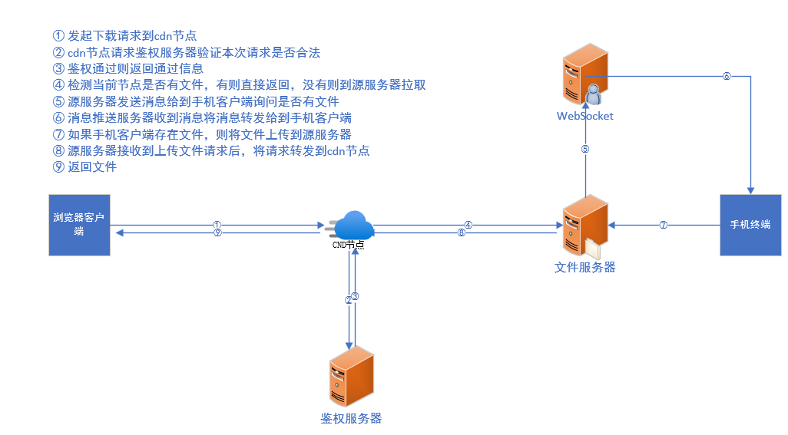

# Http请求转发

> 本项目主要是用于将http请求转发，实现两个无公网ip的客户端直接通过http请求来发送/接收数据

本项目依赖`websocket`作为消息通知服务，当`客户端`通过http请求到Http转发服务后，
通过将请求中携带的 `_aid` 参数来找到`终端`，之后将请求参数通过`websocket`发送给
`终端`，`终端`收到消息推送后，主动向Http转发服务发起http请求，将最终的响应结果推送到服务器
，然后再经由服务器将最终结果返回给`客户端`

**客户端可以不用连接到同一个websocket服务，但是Http转发服务和终端必须要连接到同一个websocket服务**



## 消息类型列表

消息载体以JSON格式传输

### 获取文件信息

名称：**httpReady@getFileInfo**   
说明：获取文件信息，终端需要监听该消息类型，当客户端发起文件下载请求后
http转发服务会通过websocket服务将该消息类型发送到终端，终端接收
到该消息类型后，需要返回指定的文件信息

发送数据字段说明

| 名称         | 类型     | 说明           |
|------------|--------|--------------|
| msgType    | string | 消息类型         |
| msg        | string | 消息说明         |
| data.path  | string | 文件完整路径       |
| data.query | object | 客户端请求查询参数    |
| msgId      | string | 本次发送的消息的唯一id |
| sender     | string | 消息发送人id      |


示例：

```json
{
  "msgType": "httpReady@getFileInfo",
  "msg": "",
  "data": {
    "path": "/video/dog.mp4",
    "query": {}
  },
  "sender": "26b01df2-407c-4403-9395-efdd51b1a057",
  "msgId": "fa4dfcae-7b3e-4411-b967-5162771b63ea"
}
```

返回数据字段说明

| 名称                     | 类型     | 必填  | 说明                                              |
|------------------------|--------|-----|-------------------------------------------------|
| msgType                | string | 是   | 消息类型，默认为：httpReady@getFileInfoAnswer            |
| data.code              | int    | 是   | 状态码：<br/>200 - 成功，<br/>404 - 文件不存在，<br/>其他则表示失败 |
| data.msg               | string | 否   | 对状态码的具体说明                                       |
| data.data.name         | string | 是   | 文件名称                                            |
| data.data.size         | int    | 是   | 文件大小                                            |
| data.data.mimeType     | string | 是   | 文件类型，例如：`image/png`                             |
| data.data.lastModified | int    | 是   | 文件最后修改时间戳（毫秒）                                   |
| msgId                  | string |  是  | 此处填入发送的消息的唯一id                                  |
| options.ids            | array  | 是   | 接收人id数组，此次填写发送人id                               |

示例：

```json
{
  "msgType": "httpReady@getFileInfoAnswer",
  "data": {
    "code": 200,
    "msg": "ok",
    "err": "",
    "data": {
      "name": "20230412_111150.mp4",
      "lastModified": 1681269392000,
      "mimeType": "video/mp4",
      "size": 603996038
    }
  },
  "msgId": "fa4dfcae-7b3e-4411-b967-5162771b63ea",
  "options": {
    "ids": [
      "26b01df2-407c-4403-9395-efdd51b1a057"
    ]
  }
}
```

### 文件接收就绪

名称：**httpReady@fileReceiveReady**   
说明：文件接收就绪，终端需要监听该消息类型，当客户端发起文件下载请求后
http转发服务在做好接收文件的准备后，会通过websocket服务将该消息类型发送到终端，终端接收
到该消息类型后，需要通过 `POST /file/upload` 接口将指定文件上传到http转发服务

发送数据字段说明

| 名称         | 类型     | 说明                |
|------------|--------|-------------------|
| msgType    | string | 消息类型              |
| msg        | string | 消息说明              |
| data.path  | string | 文件完整路径            |
| data.start | int    | 开始位置 - 从第几个字节开始读取 |
| data.end   | int    | 结束位置 - 到第几个字节结束读取 |
| data.cid   | string | 客户端请求id           |
| msgId      | string | 本次发送的消息的唯一id      |
| sender     | string | 消息发送人id           |

示例：
```json
{
    "msgType": "httpReady@fileReceiveReady",
    "msg": "",
    "data": {
        "path": "/video/dog.mp4",
        "start": 5373952,
        "end": 603848703,
        "cid": "d4cad8a9-42fc-4dd6-8b51-28d50c213cba"
    },
    "sender": "26b01df2-407c-4403-9395-efdd51b1a057",
    "msgId": "18454211-1c10-41e7-a274-24a0352bba66"
}
```

返回数据字段说明

| 名称                     | 类型     | 必填  | 说明                                              |
|------------------------|--------|-----|-------------------------------------------------|
| msgType                | string | 是   | 消息类型，默认为：httpReady@fileReceiveReadyAnswer       |
| data.code              | int    | 是   | 状态码：<br/>200 - 成功，<br/>404 - 文件不存在，<br/>其他则表示失败 |
| data.msg               | string | 否   | 对状态码的具体说明                                       |
| msgId                  | string |  是  | 此处填入发送的消息的唯一id                                  |
| options.ids            | array  | 是   | 接收人id数组，此次填写发送人id                               |

示例：
```json
{
    "msgType": "httpReady@fileReceiveReadyAnswer",
    "data": {
        "code": 200,
        "msg": "ok",
        "err": "",
        "data": []
    },
    "msgId": "18454211-1c10-41e7-a274-24a0352bba66",
    "options": {
        "ids": [
            "26b01df2-407c-4403-9395-efdd51b1a057"
        ]
    }
}
```

### 文件上传

名称：**httpReady@fileUpload**   
说明：文件上传消息类型，终端需要监听该消息类型，当客户端发起文件上传请求后
http转发服务会通过websocket服务将该消息类型发送到终端，终端接收
到该消息类型后，需要通过 `GET /file/download` 接口将上传文件下载到本地

发送数据字段说明

| 名称                         | 类型     | 说明                    |
|----------------------------|--------|-----------------------|
| msgType                    | string | 消息类型                  |
| msg                        | string | 消息说明                  |
| data.fileInfo.name         | string | 上传文件的名称，不包含路径         |
| data.fileInfo.size         | int    | 上传文件的大小，单位：字节         |
| data.fileInfo.lastModified | int    | 上传文件的最后修改时间戳，单位：毫秒    |
| data.fileInfo.mimeType     | string | 上传文件的类型，如：`image/png` |
| data.query                 | string | 客户端请求查询参数             |
| data.cid                   | string | 客户端请求id               |
| msgId                      | string | 本次发送的消息的唯一id          |
| sender                     | string | 消息发送人id               |

示例：
```json
{
    "msgType": "httpReady@fileUpload",
    "msg": "",
    "data": {
        "fileInfo": {
            "name": "aaa.zip",
            "size": 57625576,
            "lastModified": 1682318613585,
            "mimeType": "application/x-zip-compressed"
        },
        "query": {},
        "cid": "ae578e1c-056c-434b-b39d-feb565786120"
    },
    "sender": "26b01df2-407c-4403-9395-efdd51b1a057",
    "msgId": "698ddce5-2b3b-4545-8fca-6d7bf77f932b"
}
```

返回数据字段说明

| 名称          | 类型     | 必填  | 说明                                              |
|-------------|--------|-----|-------------------------------------------------|
| msgType     | string | 是   | 消息类型，默认为：httpReady@fileUploadAnswer             |
| data.code   | int    | 是   | 状态码：<br/>200 - 成功，<br/>404 - 文件不存在，<br/>其他则表示失败 |
| data.msg    | string | 否   | 对状态码的具体说明                                       |
| msgId       | string | 是   | 此处填入发送的消息的唯一id                                  |
| options.ids | array  | 是   | 接收人id数组，此次填写发送人id                               |

示例：
```json
{
    "msgType": "httpReady@fileUploadAnswer",
    "data": {
        "code": 200,
        "msg": "ok",
        "err": "",
        "data": []
    },
    "msgId": "18454211-1c10-41e7-a274-24a0352bba66",
    "options": {
        "ids": [
            "26b01df2-407c-4403-9395-efdd51b1a057"
        ]
    }
}
```

### api接口邀约

名称：**httpReady@apiOffer**   
说明：api接口邀约消息类型，终端需要监听该消息类型，当客户端发起api接口转发请求后
http转发服务会通过websocket服务将该消息类型发送到终端，终端接收
到该消息类型后，需要通过 `POST /api/answer` 接口将最终结果上报

发送数据字段说明

| 名称          | 类型     | 说明             |
|-------------|--------|----------------|
| msgType     | string | 消息类型           |
| msg         | string | 消息说明           |
| data.method | string | 本次客户端请求对应的处理方法 |
| data.query  | object | 客户端请求查询参数      |
| data.params | any    | 客户端请求体参数       |
| data.cid    | string | 客户端请求id        |
| msgId       | string | 本次发送的消息的唯一id   |
| sender      | string | 消息发送人id        |

示例：
```json
{
  "msgType": "httpReady@apiOffer",
  "msg": "",
  "data": {
    "method": "getFileList",
    "query": {
      "test": "1123"
    },
    "params": {
      "end": 1000
    },
    "cid": "5d9b4674-b4d6-459f-a14f-d97e3aae520a"
  },
  "sender": "26b01df2-407c-4403-9395-efdd51b1a057",
  "msgId": "c7c99fd1-a95d-4658-991d-902327301b5d"
}
```

返回数据字段说明

| 名称          | 类型     | 必填  | 说明                                              |
|-------------|--------|-----|-------------------------------------------------|
| msgType     | string | 是   | 消息类型，默认为：httpReady@apiAnswer                    |
| data.code   | int    | 是   | 状态码：<br/>200 - 成功，<br/>404 - 文件不存在，<br/>其他则表示失败 |
| data.msg    | string | 否   | 对状态码的具体说明                                       |
| msgId       | string | 是   | 此处填入发送的消息的唯一id                                  |
| options.ids | array  | 是   | 接收人id数组，此次填写发送人id                               |

示例：
```json
{
  "msgType": "httpReady@apiAnswer",
  "data": {
    "code": 200,
    "msg": "ok",
    "err": "",
    "data": []
  },
  "msgId": "c7c99fd1-a95d-4658-991d-902327301b5d",
  "options": {
    "ids": [
      "26b01df2-407c-4403-9395-efdd51b1a057"
    ]
  }
}
```

## 接口列表

> 说明在所有接口中带有 `_` 的参数都不会被转发到终端

### 下载文件

接口地址：http://localhost/file/download  
请求方式：GET  
请求url参数

| 名称    | 类型     | 必填              | 说明                                                                                                                                   |
|-------|--------|-----------------|--------------------------------------------------------------------------------------------------------------------------------------|
| _aid  | string | 当`_cid`参数不存在时必填 | 终端id，通过该参数可以在websocket服务中找到服务终端；<br/>该参数存在，则会通知终端将指定文件上传到http转发服务，再由http转发服务输出到响应；如：如：`7CF67DCC8C68D2BD47974FFC05760AE624290DCB:app` |
| _cid  | string | 当`_aid`参数不存在时必填 | 客户端请求id，如果该参数存在，则会通过该id找到对应的客户端请求，并将该客户端的请求内容输出到响应                                                                                   |
| _path | string | 当`_aid`参数存在时必填  | 要下载的文件的完整路径，http转发服务会将该参数通过websocket发送到终端<br/>                                                                                       |

响应  
文件流

### 上传文件

接口地址：http://localhost/file/upload  
请求方式：POST   
请求url参数

| 名称                  | 类型     | 必填              | 说明                                                                                                         |
|---------------------|--------|-----------------|------------------------------------------------------------------------------------------------------------|
| _aid                | string | 当`_cid`参数不存在时必填 | 终端id，通过该参数可以在websocket服务中找到服务终端；<br/>该参数存在时，则会通知终端来拉取数据；如：如：`7CF67DCC8C68D2BD47974FFC05760AE624290DCB:app` |
| _cid                | string | 当`_aid`参数不存在时必填 | 客户端请求id；<br/>该参数存在时，则会找到对应的客户端，将请求内容输出到该客户端的响应中                                                            |
| _filename           | string | 是               | 上传文件的名称，不包含路径                                                                                              |
| _filesize           | int    | 是               | 上传文件的大小，单位：字节                                                                                              |
| _file_last_modified | int    | 是               | 上传文件的最后修改时间戳，单位：毫秒                                                                                         |

请求体：文件

响应  
200 HttpRelay - ok

### api接口转发

接口地址：http://localhost/api  
请求方式：GET/POST   
请求url参数

| 名称                  | 类型     | 必填  | 说明                                                                               |
|---------------------|--------|-----|----------------------------------------------------------------------------------|
| _aid                | string | 是   | 终端id，通过该参数可以在websocket服务中找到服务终端；如：`7CF67DCC8C68D2BD47974FFC05760AE624290DCB:app` |
| _method             | string | 是   | 本次客户端请求对应的终端处理方法                                                                 |

响应  

### api转发应答

接口地址：http://localhost/api/answer  
请求方式：POST   
请求url参数

| 名称   | 类型     | 必填  | 说明                                              |
|------|--------|-----|-------------------------------------------------|
| _cid | string | 是   | 客户端请求id；<br/>该参数存在时，则会找到对应的客户端，将请求内容输出到该客户端的响应中 |

响应
200 HttpRelay - ok